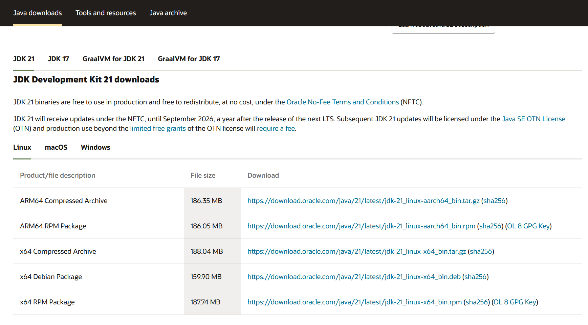
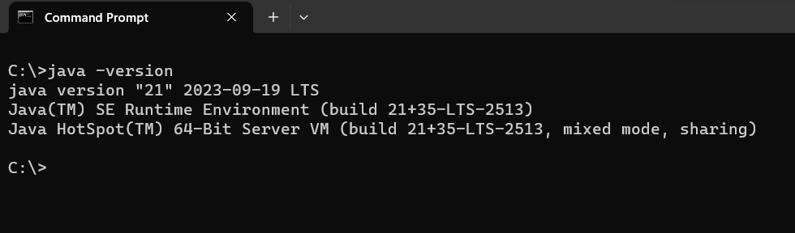

# Java 21
This repository contains information about how to install open jdk21 and samples of new features of java 21

## Installation of Java 21

1. Go to JDK download page - [Link](https://www.oracle.com/java/technologies/downloads/) 
    
2. Download jdk 21 for your operating system and install.



3. Check Java version in terminal if it is 21 using command.
```
java --version 
```



